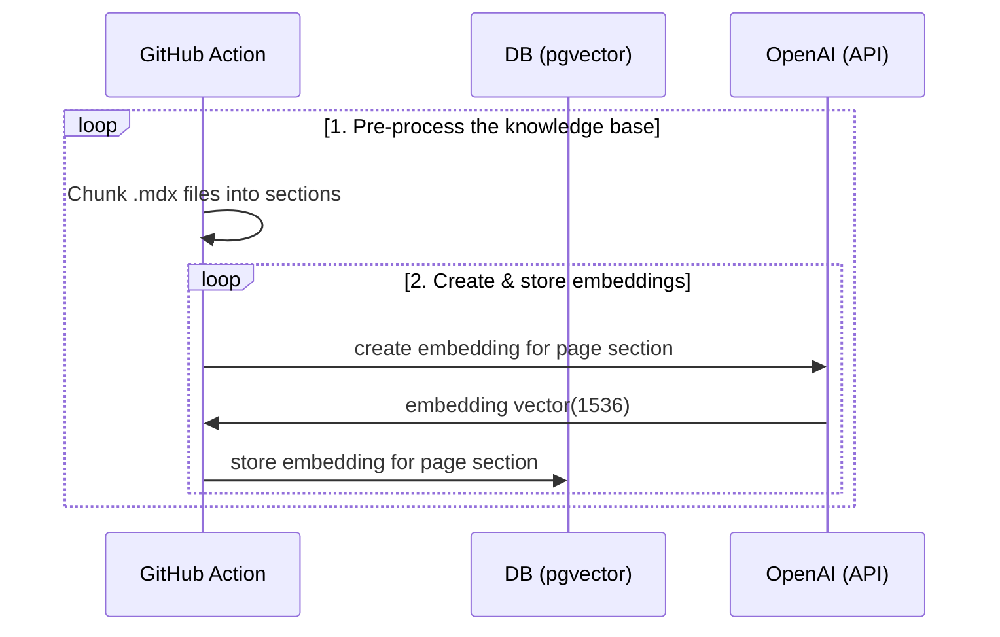
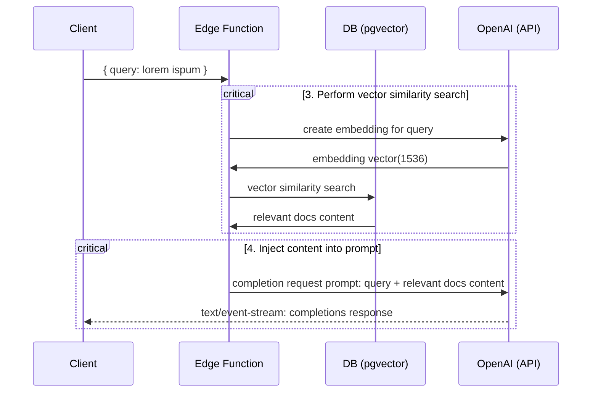

# Deno Fresh OpenAI Doc Search Starter

Template for building your own custom ChatGPT style doc search powered by Fresh,
Deno, OpenAI, and Supabase.

This starter takes all the `.mdx` files in the `docs` directory and processes
them to use as custom context within
[OpenAI Text Completion](https://platform.openai.com/docs/guides/completion)
prompts.

[](https://fresh.deno.dev)

## Run locally

### Prerequisites

- [Deno](https://deno.com/manual/getting_started/installation)
- [Docker](https://docs.docker.com/engine/install/)
- [Git](https://github.com/git-guides/install-git)
- [A free Supabase account](https://supabase.com)
- [Supabase CLI](https://supabase.com/docs/guides/cli)
- [An OpenAI Account](https://platform.openai.com/signup/)

### Setup env vars:

```bash
cp .env.example .env
```

Set the required env vars as outlined in the file.

### Start the project:

```bash
supabase start
deno task embeddings
deno task start
```

This will watch the project directory and restart as necessary.

## Deploy

### Push local migrations to Supabase

1. [Create a new project](https://app.supabase.com/projects) on Supabase
2. Link your project: `supabase link --project-ref=your-project-ref`
3. Push up migration: `supabase db push`

### Setup GitHub Action

We're using a [GitHub Action](./.github/workflows/generate-embeddings.yaml) to
generate the embeddings whenever we merge into the `main` branch.

1. Get `SUPABASE_URL` and `SUPABASE_SERVICE_ROLE_KEY` from your
   [Supabase Studio](https://app.supabase.com/project/_/settings/api) and set
   them as Actions secrets in GitHub.
2. Set `OPENAI_KEY` as Actions secrets in GitHub.
3. Push or merge into `main` to kick off the GitHub action.

### Automatic Deployment with Deno Deploy

These steps show you how to deploy your app close to your users at the edge with
[Deno Deploy](https://deno.com/deploy).

1. Clone this repository to your GitHub account.

2. Sign into [Deno Deploy](https://dash.deno.com) with your GitHub account.

3. Select your GitHub organization or user, repository, and branch

4. Select "Automatic" deployment mode and `main.ts` as the entry point

5. Click "Link", which will start the deployment.

6. Once the deployment is complete, click on "Settings" and add the production
   environmental variables, then hit "Save"

Voila, you've got your own custom ChatGPT!

## Technical Details

Building your own custom ChatGPT involves four steps:

1. [⚡️ GitHub Action] Pre-process the knowledge base (your `.mdx` files in your
   `docs` folder).
2. [⚡️ GitHub Action] Store embeddings in Postgres with
   [pgvector](https://supabase.com/docs/guides/database/extensions/pgvector).
3. [🏃 Runtime] Perform vector similarity search to find the content that's
   relevant to the question.
4. [🏃 Runtime] Inject content into OpenAI GPT-3 text completion prompt and
   stream response to the client.

## ⚡️ GitHub Action

Step 1. and 2. happen via a
[GitHub Action](./.github/workflows/generate-embeddings.yaml) anytime we make
changes to the `main` branch. During this time the
[`generate-embeddings`](./tools/generate-embeddings.ts) script is being executed
which performs the following tasks:



In addition to storing the embeddings, this script generates a checksum for each
of your `.mdx` files and stores this in another database table to make sure the
embeddings are only regenerated when the file has changed.

## 🏃 Runtime

Step 3. and 4. happen at runtime, anytime the user submits a question. When this
happens, the following sequence of tasks is performed:



The relevant files for this are the
[`SearchDialog` (Client)](./islands/SearchDialog.tsx) component and the
[`vector-search` (Edge Function)](./routes/api/vector-search.ts).

The initialization of the database, including the setup of the `pgvector`
extension is stored in the
[`supabase/migrations` folder](./supabase/migrations/) which is automatically
applied to your local Postgres instance when running `supabase start`.

## Learn More

- Read the blogpost on how we built
  [ChatGPT for the Supabase Docs](https://supabase.com/blog/chatgpt-supabase-docs).
- [[Docs] pgvector: Embeddings and vector similarity](https://supabase.com/docs/guides/database/extensions/pgvector)
- Watch [Greg's](https://twitter.com/ggrdson) "How I built this"
  [video](https://youtu.be/Yhtjd7yGGGA) on the
  [Rabbit Hole Syndrome YouTube Channel](https://www.youtube.com/@RabbitHoleSyndrome):

[](https://www.youtube.com/watch?v=Yhtjd7yGGGA)
